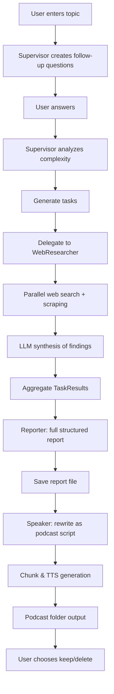

# Research Podcast Agent – AI-Powered Research-to-Podcast System

An asynchronous, multi-agent Python system that plans focused web research, executes structured information gathering, synthesizes a professional report, and converts it into a multi‑part podcast (MP3) automatically.

## ✨ Core Capabilities
- **Dynamic Research Planning** – Supervisor generates follow‑up questions and decomposes the topic.
- **Automated Web Recon** – Web Researcher performs Google Custom Search (with simulated fallback) and scrapes pages (BeautifulSoup) for relevant content.
- **Structured Synthesis** – Reporter compiles findings into a rich, sectioned research report with confidence and metadata.
- **Podcast Generation** – Speaker rewrites report into a conversational script and produces multi‑part audio via OpenAI TTS.
- **Confidence & Source Tracking** – Each task returns sources + a confidence score.
- **Fully Async Pipeline** – Uses `asyncio` for concurrent search, scraping, and LLM calls.

## 🧩 High-Level Architecture
```
┌─────────────────────────────────────────────────────────┐
│                    DeepResearchSystem                   │
│ (entrypoint: main_system.py)                            │
└───────────────┬─────────────────────────────────────────┘
                │ orchestrates
                ▼
        ┌──────────────┐  plans / delegates  ┌────────────────┐
        │ Supervisor    │────────────────────▶ Sub‑Agents Pool │
        └─────┬────────┘                      └────┬─────┬─────┘
              │ assigns                              │     │
              ▼                                      │     │
      ┌────────────────┐                     ┌────────┐  ┌────────┐
      │ Task Queue      │                     │Reporter│  │Speaker │
      └─────┬──────────┘                     └────────┘  └────────┘
            │ executes (async)
            ▼
      ┌──────────────┐
      │ WebResearcher│  (search + scrape + synthesize findings)
      └──────────────┘
```

## 🔄 Execution Flow (Mermaid)


## 📁 Project Structure
```
Deep_Research_Tool/
├── agent.py              # Base agent + TaskResult model (Pydantic)
├── main_system.py        # Entry point / orchestration / user I/O
├── supervisor.py         # Planning, decomposition, delegation
├── web_researcher.py     # Web search + scraping + source scoring
├── reporter.py           # Report synthesis (OpenAI chat completions)
├── speaker.py            # Podcast script + TTS chunked MP3 output
├── test.py               # Pytest-based component/integration tests
├── requirements.txt      # Locked dependency versions
├── podcasts/             # Generated podcast episode folders
└── .gitignore            # Ignores .env, caches, etc.
```

## 🔧 Technology Stack (Actual)
| Layer | Tools / Libraries | Notes |
|-------|-------------------|-------|
| Async runtime | `asyncio`, `aiohttp` | Parallel scraping & API calls |
| LLM access | OpenAI `chat.completions` | Direct usage (no LangChain) |
| Web scraping | `BeautifulSoup4` | HTML extraction + cleaning |
| Data models | `pydantic` | Typed TaskResult objects |
| Env/config | `python-dotenv` | Loads API keys from `.env` |
| Testing | `pytest`, `pytest-asyncio` | Unit + async integration |
| Audio | OpenAI TTS (`tts-1`) | Multi-part MP3 generation |

> ✳️ Not Used: LangChain, LangGraph, vector databases, retrieval pipelines.

## 🚀 Quick Start
```bash
# 1. Clone
git clone https://github.com/Chickychicken/Research-Podcast-Agent.git
cd Research-Podcast-Agent

# 2. (Recommended) Create virtual env
python -m venv venv
source venv/bin/activate  # Windows: venv\Scripts\activate

# 3. Install dependencies
pip install -r requirements.txt

# 4. Create .env (DO NOT COMMIT)
cat > .env <<'EOF'
OPENAI_API_KEY=your_openai_key
GOOGLE_SEARCH_API_KEY=your_google_search_api_key   # optional
GOOGLE_SEARCH_ENGINE_ID=your_cse_id                # optional
EOF

# 5. Run
python main_system.py
```

## 🗂️ Generated Artifacts
| Artifact | Location | Description |
|----------|----------|-------------|
| Research report | `research_report_<topic>.txt` | Full structured output |
| Podcast audio | `podcasts/<topic>_<timestamp>/part_*.mp3` | Sequential episode parts |

## 🛡️ Security & Secrets
- `.env` is **ignored** by Git – verify with: `git check-ignore -v .env`.
- If a secret was ever committed, rotate it immediately (OpenAI dashboard, Google Cloud console).
- Never embed API keys directly in code; environment loading handled via `dotenv` in each agent.
- Consider using GitHub Actions secrets if automating.

## 🧪 Testing
```bash
# Run all tests
pytest -v

# Focus a class
pytest test.py::TestWebResearcher::test_execute_task_success -v
```
Current tests cover: TaskResult integrity, WebResearcher behavior, Reporter synthesis formatting, basic integration flow.

## ⚙️ Configuration Knobs
| Component | Setting | Where | Purpose |
|-----------|---------|-------|---------|
| Supervisor | `max_parallel_tasks` | `supervisor.py` | Concurrency ceiling |
| WebResearcher | `max_sources` | `web_researcher.py` | Limit scraped sources |
| WebResearcher | `timeout` | `web_researcher.py` | Per-request timeout |
| Speaker | `max_chunk_size` | `speaker.py` | TTS text chunk length |
| Speaker | `voice_name` | `speaker.py` | TTS voice selection |

## 📊 Confidence & Metadata
Reports include: number of completed tasks, total sources analyzed, average confidence score, and timestamp footer for reproducibility.

## 🚧 Limitations
- Relies on public web pages (no JS rendering / headless browser yet).
- No persistence layer or vector store (stateless per run).
- Error handling is basic for some scraping edge cases (CAPTCHAs, paywalls).
- No caching; repeated queries re-fetch sources.

## 🛣️ Roadmap Ideas
- [ ] Add caching layer (SQLite or simple file cache)
- [ ] Add optional vector store for semantic enrichment
- [ ] Parallel podcast voice variants
- [ ] Web UI (FastAPI + simple frontend)
- [ ] Add retry/backoff utilities for network calls
- [ ] Configurable prompt templates via external YAML
- [ ] Structured source citation formatting (Markdown footnotes)

## 🤝 Contributing
1. Fork & branch: `git checkout -b feature/your-feature`
2. Write tests for new logic
3. Run `pytest -v`
4. Open PR with clear description + before/after behavior

## 📄 License
MIT (add a `LICENSE` file if not present).

## 🙏 Acknowledgments
- OpenAI API team for models & TTS
- BeautifulSoup maintainers
- Python async ecosystem

---
**Built for focused research ➜ structured insight ➜ spoken knowledge.**