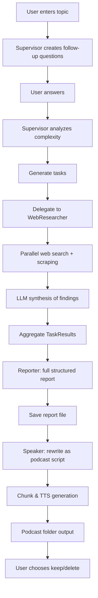

# Research Podcast Agent – AI-Powered Research-to-Podcast System

An asynchronous, multi-agent Python system that plans focused web research, executes structured information gathering, synthesizes a professional report, and converts it into a multi‑part podcast (MP3) automatically.

## ✨ Core Capabilities
- **Dynamic Research Planning** – Supervisor generates follow‑up questions and decomposes the topic.
- **Automated Web Recon** – Web Researcher performs Google Custom Search (with simulated fallback) and scrapes pages (BeautifulSoup) for relevant content.
- **Structured Synthesis** – Reporter compiles findings into a rich, sectioned research report with confidence and metadata.
- **Podcast Generation** – Speaker rewrites report into a conversational script and produces multi‑part audio via OpenAI TTS.
- **Confidence & Source Tracking** – Each task returns sources + a confidence score.
- **Fully Async Pipeline** – Uses `asyncio` for concurrent search, scraping, and LLM calls.

## 🧩 High-Level Architecture
```
┌─────────────────────────────────────────────────────────┐
│                    DeepResearchSystem                   │
│ (entrypoint: main_system.py)                            │
└───────────────┬─────────────────────────────────────────┘
                │ orchestrates
                ▼
        ┌──────────────┐  plans / delegates  ┌────────────────┐
        │ Supervisor    │────────────────────▶ Sub‑Agents Pool │
        └─────┬────────┘                      └────┬─────┬─────┘
              │ assigns                              │     │
              ▼                                      │     │
      ┌────────────────┐                     ┌────────┐  ┌────────┐
      │ Task Queue      │                     │Reporter│  │Speaker │
      └─────┬──────────┘                     └────────┘  └────────┘
            │ executes (async)
            ▼
      ┌──────────────┐
      │ WebResearcher│  (search + scrape + synthesize findings)
      └──────────────┘
```

## 🔄 Execution Flow (Mermaid)


## 📁 Project Structure
```
Deep_Research_Tool/
├── agent.py              # Base agent + TaskResult model (Pydantic)
├── main_system.py        # Entry point / orchestration / user I/O
├── supervisor.py         # Planning, decomposition, delegation
├── web_researcher.py     # Web search + scraping + source scoring
├── reporter.py           # Report synthesis (OpenAI chat completions)
├── speaker.py            # Podcast script + TTS chunked MP3 output
├── test.py               # Pytest-based component/integration tests
├── requirements.txt      # Locked dependency versions
├── podcasts/             # Generated podcast episode folders
└── .gitignore            # Ignores .env, caches, etc.
```

## 🔧 Technology Stack (Actual)
| Layer | Tools / Libraries | Notes |
|-------|-------------------|-------|
| Async runtime | `asyncio`, `aiohttp` | Parallel scraping & API calls |
| LLM access | OpenAI `chat.completions` | Direct usage (no LangChain) |
| Web scraping | `BeautifulSoup4` | HTML extraction + cleaning |
| Data models | `pydantic` | Typed TaskResult objects |
| Env/config | `python-dotenv` | Loads API keys from `.env` |
| Testing | `pytest`, `pytest-asyncio` | Unit + async integration |
| Audio | OpenAI TTS (`tts-1`) | Multi-part MP3 generation |

> ✳️ Not Used: LangChain, LangGraph, vector databases, retrieval pipelines.

## 🚀 Quick Start
```bash
# 1. Clone
git clone https://github.com/Chickychicken/Research-Podcast-Agent.git
cd Research-Podcast-Agent

# 2. (Recommended) Create virtual env
python -m venv venv
source venv/bin/activate  # Windows: venv\Scripts\activate

# 3. Install dependencies
pip install -r requirements.txt

# 4. Create .env (DO NOT COMMIT)
cat > .env <<'EOF'
OPENAI_API_KEY=your_openai_key
GOOGLE_SEARCH_API_KEY=your_google_search_api_key   # optional
GOOGLE_SEARCH_ENGINE_ID=your_cse_id                # optional
EOF

# 5. Run
python main_system.py
```

## 🗂️ Generated Artifacts
| Artifact | Location | Description |
|----------|----------|-------------|
| Research report | `research_report_<topic>.txt` | Full structured output |
| Podcast audio | `podcasts/<topic>_<timestamp>/part_*.mp3` | Sequential episode parts |

## ⚙️ Configuration Knobs
| Component | Setting | Where | Purpose |
|-----------|---------|-------|---------|
| Supervisor | `max_parallel_tasks` | `supervisor.py` | Concurrency ceiling |
| WebResearcher | `max_sources` | `web_researcher.py` | Limit scraped sources |
| WebResearcher | `timeout` | `web_researcher.py` | Per-request timeout |
| Speaker | `max_chunk_size` | `speaker.py` | TTS text chunk length |
| Speaker | `voice_name` | `speaker.py` | TTS voice selection |

## 🧠 Agent Method Reference
### Base Structures
**`agent.py`**
- `TaskResult` (Pydantic model): fields = (`task_id`, `task_description`, `findings`, `sources: List[str]`, `confidence_score: float`, `status`). Used as the unified contract for all task outputs.
- `BaseAgent` (abstract): requires `async execute_task(task: Dict[str, Any]) -> TaskResult` and `can_handle_task(task_type: str) -> bool`.

### Supervisor (`supervisor.py`)
| Method | Type | Purpose | Key Inputs | Output |
|--------|------|---------|------------|--------|
| `add_sub_agent(agent)` | sync | Register a sub-agent | agent instance | None |
| `plan_research(topic, additional_context="")` | async | Convert topic + context into structured task list | topic str, context str | List[task dict] |
| `generate_follow_up_questions(research_topic)` | async | Get 3 clarifying Qs via LLM (JSON enforced) | topic | (questions list, formatted message) |
| `delegate_tasks(tasks)` | async | Batch execution grouped by type | list of tasks | List[TaskResult] |
| `analyze_and_break_down_topic(topic, enhanced_context)` | async | Decide complexity → subtopics | topic + context | List[subtopic dict] |
| `analyze_topic_complexity(topic, enhanced_context)` | async | LLM JSON: aspects, subtopic count | topic + context | analysis dict |
| `generate_subtopics(topic, complexity_analysis, enhanced_context)` | async | LLM JSON: concrete subtopic specs | analysis data | subtopic list |
| `group_tasks_by_type(tasks)` | sync | Task grouping for load balancing | tasks | dict[type -> tasks] |
| `execute_tasks_parallel(tasks, agents)` | async | Round‑robin distribution + concurrency control | tasks + agents | List[TaskResult] |
| `execute_task(task)` | async | Handles coordinator meta‑task `coordinate_research` | task dict | TaskResult |
| `can_handle_task(task_type)` | sync | Accept only coordination types | string | bool |
| `get_research_summary()` | sync | Snapshot of system state | — | summary dict |

**Behavior Notes**:
- JSON-only prompts reduce parsing errors (fallback logic on exceptions).
- Concurrency limited via semaphore in `execute_tasks_parallel`.
- Fallback generators used if LLM JSON parsing fails for complexity or subtopics.

### WebResearcher (`web_researcher.py`)
| Method | Type | Purpose | Notes |
|--------|------|---------|-------|
| `execute_task(task)` | async | End-to-end research for a query | Orchestrates search → scrape → synthesize |
| `can_handle_task(task_type)` | sync | Supports `web_search`, `fact_checking`, `current_events` | Filters assignment |
| `perform_web_search(query)` | async | Primary search aggregator | Google API → simulated fallback |
| `call_google_search_api(query, num_results)` | async | Invoke Google CSE | Returns parsed list or raises |
| `parse_google_search_results(data)` | sync | Normalize Google response | Filters invalid URLs |
| `simulate_search_results(query)` | async | Deterministic mock results | Used when API creds missing |
| `extract_content_from_sources(results)` | async | Parallel scrape + relevance scoring | Semaphore-limited workers |
| `scrape_web_content(url)` | async | Fetch + clean HTML | Cuts length to 5000 chars |
| `clean_extracted_content(content)` | sync | Regex noise stripping | Removes nav/footer/legal junk |
| `extract_domain_from_url(url)` | sync | Domain helper | Safe parse |
| `synthesize_research_findings(query, description, context, extracted)` | async | LLM summary (300–500 words target) | Fallback summary on exception |
| `prepare_content_for_synthesis(extracted)` | sync | Trim top 3 sources for prompt | Avoids token bloat |
| `create_fallback_summary(query, extracted)` | sync | Minimal text when LLM fails | Defensive resilience |
| `extract_reliable_sources(extracted)` | sync | Filters by relevance threshold | Relevance > 0.1 |
| `calculate_confidence_score(extracted, sources)` | sync | Source count + avg relevance heuristic | Caps at 0.95 |
| `calculate_relevance_score(content, source)` | sync | Domain + length + title heuristic | Basic scoring model |

**Behavior Notes**:
- Silent resilience: falls back to simulated data or minimal summaries rather than raising.
- Relevance heuristics are pluggable (can evolve to ML scoring later).

### Reporter (`reporter.py`)
| Method | Type | Purpose | Notes |
|--------|------|---------|-------|
| `generate_report(topic, results, research_brief=None)` | async | Orchestrates synthesis pipeline | Returns final formatted string |
| `_prepare_findings_for_synthesis(results)` | sync | Build structured sections per TaskResult | Filters incomplete items |
| `_format_sources(sources)` | sync | Pretty domain list (max 5) | Falls back to bullet list |
| `_synthesize_final_report(topic, brief, synthesized_findings, results)` | async | LLM full report creation | Metadata appended |
| `_calculate_average_confidence(results)` | sync | Mean of valid confidence scores | Ignores missing |
| `_generate_metadata_footer(results)` | sync | Report stats footer | Timestamped |
| `_get_current_timestamp()` | sync | UTC timestamp | For reproducibility |
| `_generate_empty_report(topic, brief)` | async | Output when no results exist | Guidance included |
| `_generate_fallback_report(topic, results)` | async | Minimal structured alternative | Used on LLM failure |
| `generate_quick_summary(topic, results)` | async | Lightweight progress digest | Truncates finding text |

**Behavior Notes**:
- Separation of formatting vs model prompting improves testability.
- Fallback path ensures user never receives an exception blob.

### Speaker (`speaker.py`)
| Method | Type | Purpose | Notes |
|--------|------|---------|-------|
| `create_podcast_from_report(report, topic_name, play_audio=False)` | async | Orchestrates script conversion + audio creation | Returns output directory |
| `_edit_report_for_podcast(report, topic_name)` | async | LLM rewrite to conversational script | Injects style guidance |
| `_convert_text_to_audio(text, topic_name)` | sync | Split + iterate TTS generation | Creates timestamped folder |
| `_generate_speech(text, output_file)` | sync | OpenAI TTS call per chunk | Serial with small delay |
| `_split_into_chunks(text, max_length)` | sync | Sentence-aware splitting | Hard cap per chunk |
| `set_voice(voice_name)` | sync | Validate and set TTS voice | Safe whitelist |
| `play_audio(audio_path)` | sync | Cross-platform playback | macOS/Linux/Windows handling |

**Behavior Notes**:
- Uses both async (script edit) and sync (TTS) flows intentionally.
- Chunked design avoids hitting model limits and enables resumability.

### DeepResearchSystem (`main_system.py`)
| Method | Type | Purpose |
|--------|------|---------|
| `_setup_agents()` | sync | Instantiate and register sub-agents |
| `conduct_web_research(topic, research_brief=None)` | async | Full pipeline: questions → tasks → results → report |
| `get_research_status()` | async | Snapshot of operational state |
| `_generate_error_report(topic, error_message)` | async | Consistent failure artifact |

**Extensibility Tips**:
- Add a new agent by subclassing `BaseAgent`, implementing `execute_task` & `can_handle_task`, then registering in `_setup_agents`.
- Introduce a persistence layer by wrapping TaskResult writes in an async repository class.
- Replace relevance heuristic with ML scoring by injecting a strategy object.

## 📊 Confidence & Metadata
Reports include: number of completed tasks, total sources analyzed, average confidence score, and timestamp footer for reproducibility.

## 🚧 Limitations
- Relies on public web pages (no JS rendering / headless browser yet).
- No persistence layer or vector store (stateless per run).
- Error handling is basic for some scraping edge cases (CAPTCHAs, paywalls).
- No caching; repeated queries re-fetch sources.

## 🛣️ Roadmap Ideas
- [ ] Add caching layer (SQLite or simple file cache)
- [ ] Web UI (FastAPI + simple frontend)
- [ ] Add retry/backoff utilities for network calls
- [ ] Configurable prompt templates via external YAML
- [ ] Structured source citation formatting (Markdown footnotes)

## 🤝 Contributing
1. Fork & branch: `git checkout -b feature/your-feature`
2. Write tests for new logic
3. Run `pytest -v`
4. Open PR with clear description + before/after behavior

## 🙏 Acknowledgments
- OpenAI API team for models & TTS
- BeautifulSoup maintainers
- Python async ecosystem

---
**Built for focused research ➜ structured insight ➜ spoken knowledge.**