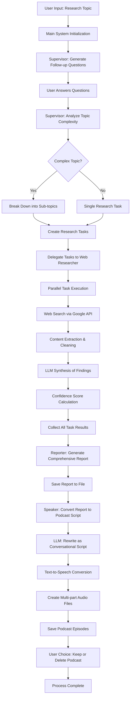

# Deep Research Tool - AI-Powered Research to Podcast Generator

An intelligent research system that leverages multiple AI agents to conduct comprehensive web research on any topic and automatically converts the findings into engaging podcast episodes.

## 🌟 Features

- **Multi-Agent Research System**: Coordinated team of AI agents for comprehensive research
- **Intelligent Query Planning**: LLM-powered research strategy with follow-up questions
- **Web Content Extraction**: Real-time web scraping and content synthesis
- **Comprehensive Reporting**: Professional research reports with citations
- **Podcast Generation**: Automatic conversion of research reports to audio podcasts
- **Parallel Processing**: Efficient concurrent task execution
- **Source Validation**: Confidence scoring and source reliability assessment

## 🏗️ System Architecture

```
┌─────────────────────────────────────────────────────────────────┐
│                    Deep Research System                         │
└─────────────────────────┬───────────────────────────────────────┘
                          │
┌─────────────────────────▼───────────────────────────────────────┐
│                   Main System                                   │
│  • User interface                                               │
│  • Flow coordination                                            │
│  • File management                                              │
└─────────────────────────┬───────────────────────────────────────┘
                          │
┌─────────────────────────▼───────────────────────────────────────┐
│                   Supervisor Agent                              │
│  • Research planning                                            │
│  • Task decomposition                                           │
│  • Agent coordination                                           │
│  • Parallel execution                                           │
└─────────────────────────┬───────────────────────────────────────┘
                          │
                          ▼
              ┌───────────────────────┐
              │    Sub-Agents Pool    │
              └───────────┬───────────┘
                          │
        ┌─────────────────┼─────────────────┐
        ▼                 ▼                 ▼
┌─────────────┐  ┌─────────────┐  ┌─────────────┐
│Web Research │  │  Reporter   │  │   Speaker   │
│    Agent    │  │    Agent    │  │    Agent    │
│• Web search │  │• Report     │  │• TTS        │
│• Content    │  │  synthesis  │  │• Podcast    │
│  extraction │  │• Citation   │  │  creation   │
│• Fact check │  │• Formatting │  │• Audio      │
└─────────────┘  └─────────────┘  └─────────────┘
```

## 🔄 Program Flow Diagram



## 📁 Project Structure

```
Deep_Research_Tool/
├── main_system.py          # Main orchestration and user interface
├── supervisor.py           # Task planning and agent coordination
├── web_researcher.py       # Web search and content extraction
├── reporter.py            # Report generation and synthesis
├── speaker.py             # Podcast creation and TTS
├── agent.py               # Base agent classes and interfaces
├── test.py                # Comprehensive test suite
├── requirements.txt       # Python dependencies
├── .env                   # API keys and configuration
├── .gitignore            # Git ignore patterns
└── podcasts/             # Generated podcast episodes
    └── [topic]_[timestamp]/
        ├── part_1.mp3
        ├── part_2.mp3
        └── ...
```

## 🚀 Quick Start

### Prerequisites

- Python 3.8+
- OpenAI API key
- Google Search API key (optional, has fallback)

### Installation

1. **Clone the repository**
   ```bash
   git clone https://github.com/Chickychicken/Research-Podcast-Agent.git
   cd Research-Podcast-Agent
   ```

2. **Install dependencies**
   ```bash
   pip install -r requirements.txt
   ```

3. **Set up environment variables**
   Create a `.env` file in the project root:
   ```env
   OPENAI_API_KEY=your_openai_api_key_here
   GOOGLE_SEARCH_API_KEY=your_google_search_api_key_here
   GOOGLE_SEARCH_ENGINE_ID=your_search_engine_id_here
   GEMINI_API_KEY=your_gemini_api_key_here
   ```

4. **Run the system**
   ```bash
   python main_system.py
   ```

## 💡 Usage Example

```bash
🔬 Deep Research Tool
========================================
Enter research topic: Impact of AI on healthcare

📋 Planning research strategy...

To better focus the research, please consider these follow-up questions:

1. Are you interested in current applications or future potential of AI in healthcare?
2. Should the research focus on specific medical specialties or general healthcare?
3. Are you looking for benefits, challenges, or both aspects of AI implementation?

Your answer to question 1: Current applications and near-term developments
Your answer to question 2: General healthcare with focus on diagnostics
Your answer to question 3: Both benefits and challenges

🔍 Executing research tasks...
✅ Completed 4 research tasks
📊 Generating final report...
🎉 Research completed successfully!
📄 Full report saved to research_report_Impact_of_AI_on_healthcare.txt

🎙️ Converting report to podcast format...
🎵 Podcast created at: podcasts/Impact_of_AI_on_healthcare_20250915_143022/

Would you like to keep this podcast file? (y/n): y
```

## 🔧 Configuration

### API Keys Required

| Service | Required | Purpose | Fallback |
|---------|----------|---------|----------|
| OpenAI API | ✅ Yes | LLM operations, TTS | None |
| Google Search API | ❌ Optional | Web search | Simulated results |
| Gemini API | ❌ Optional | Additional LLM | OpenAI only |

### Customization Options

- **Voice Selection**: Change TTS voice in `speaker.py`
- **Model Selection**: Modify LLM models in agent constructors
- **Parallel Tasks**: Adjust `max_parallel_tasks` in supervisor
- **Content Limits**: Modify `max_sources` and chunk sizes

## 🧪 Testing

Run the comprehensive test suite:

```bash
# Run all tests
python -m pytest test.py -v

# Run specific test categories
python -m pytest test.py::TestWebResearcher -v
python -m pytest test.py::TestReporter -v
```

## 📊 Features in Detail

### Research Planning
- **Intelligent Decomposition**: LLM analyzes topic complexity
- **Follow-up Questions**: Gathers context for focused research
- **Parallel Execution**: Concurrent task processing
- **Adaptive Strategy**: Adjusts approach based on topic complexity

### Web Research
- **Multi-Source Search**: Google API integration with fallbacks
- **Content Extraction**: BeautifulSoup-powered scraping
- **Quality Scoring**: Relevance and reliability assessment
- **Error Handling**: Graceful failure management

### Report Generation
- **LLM Synthesis**: GPT-4 powered analysis and writing
- **Professional Format**: Academic-style reporting
- **Source Citations**: Proper attribution and references
- **Metadata Tracking**: Confidence scores and statistics

### Podcast Creation
- **Script Conversion**: LLM rewrites reports conversationally
- **Multi-part Audio**: Automatic chunking for long content
- **Voice Options**: Multiple TTS voice selections
- **Cross-platform Playback**: macOS, Windows, Linux support

## 🔍 Technical Details

### Key Technologies
- **Async/Await**: Non-blocking concurrent operations
- **LangChain**: LLM orchestration and chaining
- **BeautifulSoup**: HTML parsing and content extraction
- **OpenAI APIs**: GPT-4 and TTS-1 models
- **Google Custom Search**: Real-time web search
- **Pydantic**: Type validation and data models

### Performance Optimizations
- **Semaphore Limiting**: Prevents API rate limiting
- **Connection Pooling**: Efficient HTTP requests
- **Content Caching**: Reduces redundant processing
- **Error Recovery**: Robust fallback mechanisms

## 🚧 Limitations

- **API Costs**: OpenAI usage can accumulate charges
- **Rate Limits**: Google Search API has daily quotas
- **Content Quality**: Dependent on source website accessibility
- **Language Support**: Currently optimized for English content

## 🤝 Contributing

1. Fork the repository
2. Create a feature branch (`git checkout -b feature/amazing-feature`)
3. Commit changes (`git commit -m 'Add amazing feature'`)
4. Push to branch (`git push origin feature/amazing-feature`)
5. Open a Pull Request

## 📝 License

This project is licensed under the MIT License - see the [LICENSE](LICENSE) file for details.

## 🙏 Acknowledgments

- OpenAI for GPT-4 and TTS capabilities
- Google for Custom Search API
- BeautifulSoup team for HTML parsing
- LangChain community for LLM orchestration

## 🆘 Support

For questions or issues:
1. Check the [Issues](https://github.com/Chickychicken/Research-Podcast-Agent/issues) page
2. Review the test suite for usage examples
3. Examine the code documentation and comments

---

**Made with ❤️ for researchers, students, and podcast enthusiasts**